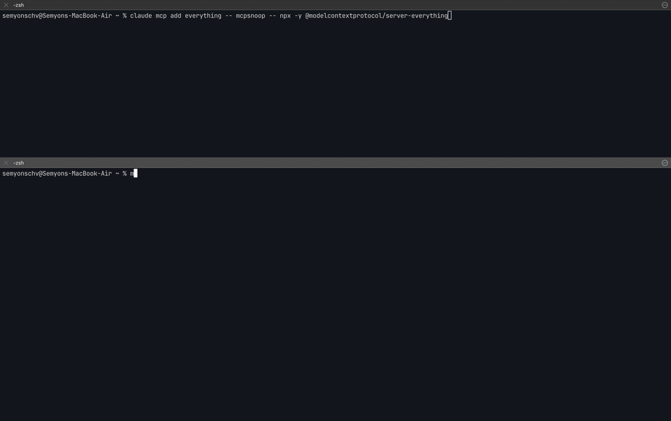
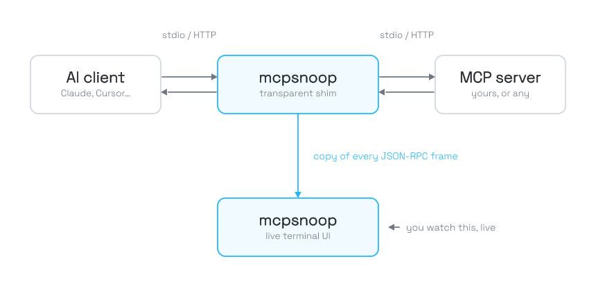

<p align="center">
  
</p>

**Wireshark for MCP.** A transparent proxy that shows every real tool call
between your AI client and your MCP servers, live in your terminal.

[](https://github.com/kerlenton/mcpsnoop/actions/workflows/ci.yml)
[](https://pkg.go.dev/github.com/kerlenton/mcpsnoop)
[](LICENSE)

<p align="center">
  
</p>

## The problem

The official [MCP Inspector](https://github.com/modelcontextprotocol/inspector)
connects as its own client, so it never sees what *your* client (Cursor, Claude
Code, Codex) actually sends your server. And anything that waits for a request
to arrive can't show the call the model never made, or made with the wrong
arguments. When a tool silently isn't called, capabilities don't line up, or a
call just hangs, you're left digging through logs and guessing.

**mcpsnoop sits in the real data path instead.** Wrap your server command with
it and watch every JSON-RPC frame live, as your real client and server talk.

## Quick start

See it right away, with nothing to set up.

```bash
mcpsnoop demo
```

To use it for real, wrap your server in your client's MCP config.

```json
{
  "mcpServers": {
    "my-server": {
      "command": "mcpsnoop",
      "args": ["--", "node", "build/index.js"]
    }
  }
}
```

Everything after `--` is the command that normally launches your server. Swap in
whatever you already use, like `python server.py`, `npx -y @scope/server`, or a
compiled binary. Then use your client as usual and open the UI.

```bash
mcpsnoop
```

No flags, no socket paths, no startup order to remember. The shim and the UI find
each other on their own, and the UI backfills past sessions from disk.

For a streamable-HTTP server, run mcpsnoop as a reverse proxy.

```bash
mcpsnoop http --target http://localhost:3000/mcp --listen :7000
```

No server of your own? [Try it for real](docs/TRY_IT.md) against a published
test server, driven by your own client. To inspect a session after it happened,
see [review past sessions from logs](docs/POST_MORTEM.md).

### Config file

If you reuse the same shim flags across a project, put them in a
`.mcpsnoop.toml` file in the current working directory.

```toml
label = "filesystem"
trace-file = "trace.jsonl"
redact-secrets = true
redact-key = "token,authorization"
redact-value = "sk-[A-Za-z0-9]+"
redact-path = "$.params.arguments.password"
no-trace = false
```

Repeat `redact-key`, `redact-value`, and `redact-path` on their own lines to add
more than one of each.

Those are all the keys it supports.

The file is only looked up in the current working directory, not in parent
directories.

Explicit command-line flags override values from the config file.

## Commands

| Command | What it does |
|---|---|
| `mcpsnoop -- <server>` | wrap a stdio server as a transparent shim |
| `mcpsnoop` | open the live TUI |
| `mcpsnoop http --target <url>` | proxy a streamable-HTTP server |
| `mcpsnoop export` | render a session to json, html, text, har, or otlp |
| `mcpsnoop check` | fail CI on errors, invalid frames, warnings, routing mismatches, or hung calls |
| `mcpsnoop baseline` | inspect, accept, or reset trusted tool definitions |
| `mcpsnoop diff` | compare tools and calls across two captured sessions |
| `mcpsnoop open` | open a saved session in the TUI |
| `mcpsnoop prune` | delete saved session logs older than a cutoff |
| `mcpsnoop remote <user@host>` | print the SSH tunnel command |
| `mcpsnoop demo` | play a scripted session |

Run `mcpsnoop help` for the full list, or `mcpsnoop help <command>` for the flags of one.

## How it compares

| | MCP Inspector | mcpsnoop |
|---|:---:|:---:|
| Sees your real client and server traffic | no | yes |
| Flags hung calls and stream errors | no | yes |
| Flags stray output that corrupts the stream | no | yes |
| Flags malformed JSON-RPC frames | no | yes |
| Detects tool definition drift after approval | no | yes |
| Interactive terminal UI | no | yes |
| Zero-config, no flags or ordering | no | yes |
| Capability inspector | partial | yes |
| Replay a captured call | no | yes |
| Session export (json / html / text / otlp) | no | yes |
| Single binary, no runtime deps | no | yes |

## Install

### Go

```bash
go install github.com/kerlenton/mcpsnoop/cmd/mcpsnoop@latest
```

### Homebrew

```bash
brew install kerlenton/mcpsnoop/mcpsnoop
```

Prebuilt binaries for every platform are on the [Releases](https://github.com/kerlenton/mcpsnoop/releases) page.

### Shell completions

mcpsnoop ships completions for bash, zsh, fish, and PowerShell. Run
`mcpsnoop completion <shell> --help` for the setup steps, which cover enabling
completion and the install path for your OS.

## How it works

<p align="center">
  <picture>
    <source media="(prefers-color-scheme: dark)" srcset="assets/architecture-dark.svg">
    
  </picture>
</p>

mcpsnoop is two roles in one binary. `mcpsnoop -- <server>` is the transparent
shim your client spawns, forwarding bytes verbatim while shipping a copy of every
frame to the hub. `mcpsnoop` with no arguments is that hub and its live TUI. They
pair through a well-known socket and on-disk logs, so neither has to start first.

The hub loads the newest 100 saved sessions by default, keeping startup work
bounded without deleting older traces. Use `mcpsnoop --history-limit N` to pick
another limit, or `mcpsnoop --history-limit 0` to load the full history. Older
sessions remain available through `mcpsnoop open <session-id>` and
`mcpsnoop export <session-id>`.

The history limit bounds what is loaded; `mcpsnoop prune` bounds what is kept.
It deletes saved session logs older than a cutoff, and never runs on its own.

```bash
mcpsnoop prune --older-than 30d --dry-run   # list what would go, remove nothing
mcpsnoop prune --older-than 30d             # delete after confirming
mcpsnoop prune --older-than 72h --yes       # skip the prompt in a script
```

`--older-than` is required (there is no default that would delete anything) and
accepts a day count like `30d` or a Go duration like `72h`. Tool baselines are
left alone, since a baseline is keyed by server label rather than by session.

Because it sits in the actual pipe, not off to the side like the Inspector, it
sees exactly what your real client and server say to each other, whatever the
server is written in.

## Keybindings

| Key | Action | | Key | Action |
|---|---|---|---|---|
| `enter` | inspect / drill in | | `/` | filter |
| `esc` | back | | `:` | command |
| `j` / `k` | move | | `r` | replay a call |
| `g` / `G` | top / bottom | | `c` | capabilities |
| `ctrl-f` / `ctrl-b` | page | | `s` | tool summary |
| `p` | pause | | `y` | copy |
| `shift`+`<key>` | sort by column | | `e` | export |
| `ctrl-d` | delete session | | `f` | follow |
| `?` | help | | | |

Press `?` in the app for the full list.

## Filtering the stream

Press `/` in a session and combine space-separated tokens, ANDed. Plain text
matches the method, tool, id, and payload.

| Token | Filters by | Example |
|---|---|---|
| `tool:` | tool name | `tool:search` |
| `method:` | JSON-RPC method | `method:tools/call` |
| `id:` | request id, and any retry continuing it | `id:7` |
| `task:` | task id | `task:01J...` |
| `dir:` | direction (`c2s`, `s2c`) | `dir:s2c` |
| `kind:` | frame type (`req`, `resp`, `notify`, `stderr`, `invalid`) | `kind:invalid` |
| `status:` | call outcome (`ok`, `error`, `cancelled`, `pending`, `bad`, `warn`, `mismatch`) | `status:error` |

Stack tokens to get specific.

```text
tool:search status:pending        # in-flight calls to one search tool
method:tools/call status:error    # tool calls that failed
dir:s2c kind:req                  # server-initiated requests (servers before 2026-07-28)
```

The last one only finds anything on a server speaking 2025-11-25 or earlier. The
2026-07-28 revision removed server-initiated requests, and a server that needs
something from the client now answers the client's own request asking for it,
then the client retries. mcpsnoop links those retries back to the request they
continue, so the exchange reads as one call rather than several.

## Exporting sessions

Turn any captured session into a portable file.

```bash
mcpsnoop export -T json|html|text|har|otlp [-o file|-] [session-id|log.jsonl|-]
```

| Format | What you get |
|---|---|
| `json` | correlated calls, per-tool counts and p50/p95/p99 latency, slowest calls, capabilities, and raw frames |
| `html` | a self-contained browser file with search and collapsible JSON |
| `text` | a pretty plain-text dump |
| `har` | one entry per correlated call, openable in browser devtools and anything else that reads HAR |
| `otlp` | OTLP JSON with a trace per session and a span per correlated call |

MCP is not HTTP, so a HAR entry's URL, status code, and timings are a deliberate
mapping of each call rather than a wire transcript.

```bash
mcpsnoop export -T html -o out.html       # an HTML file to open in a browser
mcpsnoop export -T text server.py-48213   # a specific session, as text
mcpsnoop export -T json | jq              # the newest session, piped to jq
mcpsnoop export -T har -o session.har     # a HAR file to open in browser devtools
mcpsnoop export -T otlp -o trace.json     # import into an OTLP-compatible tracing backend
```

Omit `-o` to write to stdout, and omit the session to take the newest, or pass
`-` to read JSONL from stdin. In the TUI, press `e` to export the selected
session as HTML, or run `:export json|html|text|har|otlp [path]` from command mode.

### Stream completed calls to an OTLP collector

Send spans while the proxy is running by pointing it at an OTLP/HTTP JSON
traces endpoint. Repeat `--otlp-header` for collector authentication or tenant
headers.

```bash
mcpsnoop \
  --otlp-endpoint http://localhost:4318/v1/traces \
  --otlp-header "Authorization=Bearer $OTLP_TOKEN" \
  -- node build/index.js

mcpsnoop http \
  --target http://localhost:3000/mcp \
  --otlp-endpoint http://localhost:4318/v1/traces
```

Delivery is best-effort and never blocks proxied MCP traffic. If the collector
is unavailable, mcpsnoop retries in the background and drops new trace frames
when its bounded queue is full. The normal JSONL session log remains the durable
record.

## Comparing sessions

Compare two saved sessions by id or JSONL path.

```bash
mcpsnoop diff before-session after-session
mcpsnoop diff old.jsonl new.jsonl
```

The report shows tools that were added or removed, description and `inputSchema`
changes, matching tool calls whose status changed, and notable duration shifts. Calls
are matched by tool name and arguments, so reordered calls still compare correctly.
By default, duration changes must differ by at least 100 ms and 2x; use
`--duration-threshold` and `--duration-ratio` to adjust those cutoffs.

Pass `--exit-code` to gate CI on regressions: it exits non-zero when the after
session drops a tool, changes a tool description or input schema, has a call whose
status got worse, or slows down. A description-only change now counts as a
regression too. Improvements (added tools, fixed calls, speedups) still exit zero.

## Checking sessions in CI

Gate a recorded agent run on errors, stream corruption, protocol warnings,
routing-header mismatches, calls that never got a response, tool-definition
drift, or use of deprecated protocol features.

```bash
mcpsnoop check [--format text|junit] [--fail-on error,invalid,warn,mismatch,pending,drift,deprecated] [session-id|log.jsonl|-]
```

The three default signals (error, invalid, warn) fail the check. Add `pending`
to gate on calls that never got a response, `mismatch` to gate specifically on a
routing header (Mcp-Method or Mcp-Name) disagreeing with the body, `drift` to gate
on tool definitions changing after approval, or `deprecated` to gate on features
the spec has deprecated. Pass a comma-separated subset to select only the
conditions relevant to a job. Omit the session to check the newest capture, or use
`-` to read JSONL from stdin.
Use `--format junit` to write one JUnit `<testcase>` per signal and session;
failures follow the same `--fail-on` selection as the text output.

```bash
mcpsnoop check build-agent
mcpsnoop check --fail-on error,invalid artifacts/session.jsonl
mcpsnoop check --fail-on mismatch gateway-run.jsonl
```

Beyond the signal counts, assert the shape of the run. These compose with each
other and with `--fail-on`, and any failure exits non-zero.

| Flag | Fails when |
|---|---|
| `--max-duration <dur>` | one or more completed tool calls exceeded the budget; reports their count and the worst call |
| `--expect-tool <name>` | the named tool was never called (repeatable) |
| `--forbid-tool <name>` | the named tool was called (repeatable) |

```bash
# a contract for the run: search must run, delete must not, nothing over 2s
mcpsnoop check --expect-tool search --forbid-tool delete --max-duration 2s run.jsonl
```

```yaml
- name: Check captured MCP session
  run: |
    mkdir -p test-results
    mcpsnoop check --format junit artifacts/session.jsonl > test-results/mcpsnoop.xml
- name: Upload mcpsnoop JUnit report
  if: always()
  uses: actions/upload-artifact@v4
  with:
    name: mcpsnoop-junit
    path: test-results/mcpsnoop.xml
```

### Detect tool definition drift

The first complete `tools/list` observed for a server label becomes its trusted
baseline. Later sessions compare tool descriptions and input schemas with that
baseline, including tools that were added or removed. The sessions table and
tool summary flag drift without blocking or changing MCP traffic.

Use a stable, unique `--label` for each server whose command name or target host
would otherwise collide. Baselines are stored under the normal mcpsnoop state
directory, so `MCPSNOOP_HOME` and `XDG_STATE_HOME` apply.

```bash
mcpsnoop check --fail-on drift session.jsonl
mcpsnoop baseline session.jsonl
mcpsnoop baseline --accept session.jsonl  # trust a legitimate definition change
mcpsnoop baseline --reset session.jsonl   # trust the next complete tools/list
```

In ephemeral CI the state directory starts empty, so the first run only records
the baseline and reports no drift. The baseline has to persist across runs for
later runs to verify against it. Point `--baseline` at a checked-in or cached
directory, or set `MCPSNOOP_HOME` to a persisted path.

```bash
mcpsnoop check --fail-on drift --baseline .mcpsnoop/baselines session.jsonl
```

`drift` is opt-in for `check`; the default `error,invalid,warn` gate is unchanged.

### Flag deprecated protocol features

The 2026-07-28 revision deprecates Roots, Sampling, and Logging. They keep working
for at least a year, so mcpsnoop marks them rather than treating them as errors.
The stream, the capability inspector, and the export all flag them, and each marker
names the replacement.

Two of the three are now reachable only through a multi round-trip request, where
the method name sits inside the server's `inputRequests` map rather than on the
frame itself. Those are flagged too, so a server that moved to the new pattern
does not silently stop reporting.

```bash
mcpsnoop check --fail-on deprecated session.jsonl
```

Like `drift`, `deprecated` is opt-in. A default run reports the count and stays
green, so a session using a still-legal deprecated feature never turns CI red on
its own.

### Flag schema constructs clients handle badly

A server can be perfectly valid and still be hard for an agent to use. Clients
differ in how much of JSON Schema they really support, and a tool the model keeps
calling wrongly is often a tool whose schema asked for more than the client
delivers.

The tool summary, opened with `s`, has a SCHEMA column naming the most notable
construct each advertised tool uses, with a trailing `+` when the schema uses
more than one kind.

| Shown | Means |
|---|---|
| `ext ref` | a `$ref` pointing outside the document, which is also the case the spec warns implementers not to follow blindly |
| `oneOf`, `anyOf`, `allOf`, `not` | a composition keyword, handled inconsistently across clients |
| `ref` | a `$ref` pointing inside the same document |
| `untyped` | a property that declares no type and no other way of saying what it accepts |

This is an observation, not a verdict. A schema using `oneOf` is not wrong, only
likely to be read differently by different clients, so the column carries the
warning color and never the red of the ERR column. There is no `check` signal for
it, and nothing about MCP traffic changes.

Nothing is resolved or fetched. An external `$ref` is recognized by its form
alone, and the schema it points at is never read.

### Detect a client that mangles server state

Under the multi round-trip pattern the server hands the client an opaque
`requestState` and the client must echo it back untouched on the retry. The
server is told to treat it as attacker-controlled input, because a client that
tampers with it can try to alter server behaviour or bypass an authorization
check.

Sitting in the pipe, mcpsnoop sees the value leave and come back, so it can say
when the contract was broken. Three ways it can break, each reported as a
protocol warning on the retry.

| Reported | Means |
|---|---|
| `MRTR retry changed requestState` | the client sent back something other than what the server issued |
| `MRTR retry is missing requestState` | the server issued one and the retry omitted it |
| `MRTR retry invented requestState` | the retry carried one the server never issued |

These are protocol violations by the client rather than observations of ours, so
they ride the ordinary warning signal and **a default `check` run fails on one**.
That is deliberate. A client mangling server state is worth stopping a build for.

The value itself is never displayed or logged, and nothing decodes or parses it.
It may be an encrypted blob carrying a principal and a token, and comparing
opaque bytes is the whole check.

One case is out of reach. When a server answers with a `requestState` and no
`inputRequests`, a tampered retry matches nothing and answers no keys, so there
is nothing left to tie it to the original request and it reads as an unrelated
call rather than a violation.

## Watching from another machine

Keep capture local to the machine where the traffic happens and use SSH for the
network hop, so mcpsnoop never needs a remote transport of its own.

### Live view

Run the TUI on your workstation and forward the remote machine's mcpsnoop socket
back to it. The live tunnel uses SSH Unix-socket forwarding, so both ends must
run Linux or macOS. On Windows, use the post-mortem log copy below.

```bash
# on your workstation, start the TUI
mcpsnoop

# create the remote socket directory once
ssh remote-user@remote-host 'mkdir -p ~/.local/state/mcpsnoop'

# print the tunnel command, then run the printed ssh -R line
mcpsnoop remote remote-user@remote-host

# on the remote host, wrap your server as usual
mcpsnoop -- node build/index.js
```

The socket lives under the remote's state directory, resolved as `MCPSNOOP_HOME`,
else `XDG_STATE_HOME/mcpsnoop`, else `~/.local/state/mcpsnoop`. By default mcpsnoop
assumes the Linux home `/home/<user>` from your `user@host` and prints a reminder
to stderr whenever it falls back to that guess. If the remote resolves elsewhere,
name the one non-default piece.

```bash
# a non-Linux or custom home, macOS is /Users/<user> and root is /root
mcpsnoop remote --remote-home /Users/remote-user remote-user@remote-host

# an explicit MCPSNOOP_HOME on the remote
mcpsnoop remote --remote-mcpsnoop-home /srv/mcpsnoop remote-user@remote-host

# an explicit XDG_STATE_HOME on the remote
mcpsnoop remote --remote-xdg-state-home /var/lib/state remote-user@remote-host
```

### Post-mortem

Stream a remote session straight into the TUI over SSH, no local copy needed.

```bash
ssh remote-user@remote-host 'cat ~/.local/state/mcpsnoop/sessions/session.jsonl' | mcpsnoop open -
```

To keep a local copy instead, scp the logs into your sessions directory and run
the TUI as normal.

```bash
# copy the remote logs into your local sessions directory
mkdir -p ~/.local/state/mcpsnoop/sessions
scp remote-user@remote-host:'~/.local/state/mcpsnoop/sessions/*.jsonl' \
  ~/.local/state/mcpsnoop/sessions/

# open the TUI, it backfills the copied sessions
mcpsnoop
```

## Security

mcpsnoop runs the server command you wrap, so only wrap servers you trust, and
run untrusted ones in a container. It never executes anything you didn't put in
your client config.

Captured frames can include prompts, tool arguments, credentials, and tool
results. If payloads can carry secrets, opt in to redaction to scrub the
observed trace copies while the proxied bytes still pass through unchanged.
Key-based redaction replaces whole values under matching JSON object keys, and
the same key set is applied best effort to the wrapped server's command-line
arguments, so `--api-key=sk-x` and `--token sk-x` are scrubbed under
`--redact-secrets`. An argument that carries a secret without a recognizable flag
name cannot be detected.
Path-based redaction replaces only values selected by a JSONPath expression,
which is useful when a common key name is sensitive in one location but safe in
another. Repeat `--redact-path` to scrub more than one location.
Value-based redaction applies regular expressions to observed string values,
stderr text, and non-JSON text frames. All redaction modes are best effort.
Regexes can miss secrets, overmatch harmless text, or fail to see transformed
or encoded values.

```bash
# built-in preset of common secret keys
mcpsnoop --redact-secrets -- node build/index.js

# or name your own keys
mcpsnoop --redact-key token,api_key,password -- node build/index.js

# scrub one location without redacting every field named password
mcpsnoop --redact-path '$.params.arguments.password' -- node build/index.js

# wildcards scrub every matching array element
mcpsnoop --redact-path '$.params.arguments.accounts[*].password' -- node build/index.js

# scrub obvious token-shaped values outside known keys
mcpsnoop --redact-value 'sk-[A-Za-z0-9]+' -- node build/index.js

# combine the layers in http mode
mcpsnoop http --target http://localhost:3000/mcp --redact-secrets --redact-value 'Bearer\s+\S+'
```

For remote workflows, use SSH tunnelling or SSH file transfer so transport auth,
encryption, host verification, key rotation, and audit policy stay in your
existing SSH setup.

## Contributing

Issues and pull requests are welcome. See [CONTRIBUTING.md](CONTRIBUTING.md) for
the details.

## License

[MIT](LICENSE)
