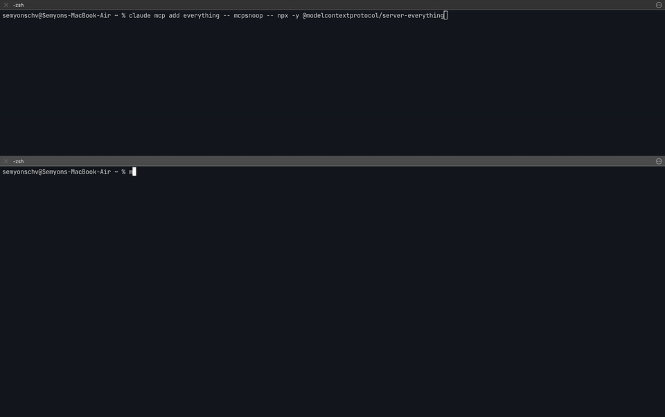
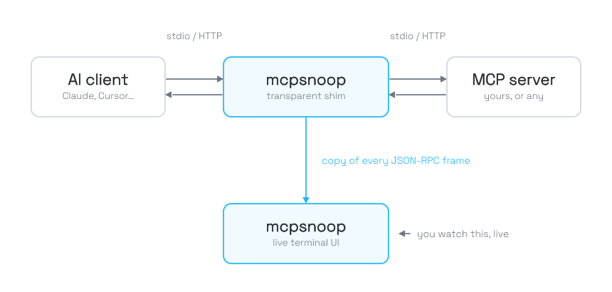

<p align="center">
  
</p>

**Wireshark for MCP.** mcpsnoop sits between your AI client and your MCP server
and records every JSON-RPC frame they exchange, with no change to either side.
Watch it live in your terminal, fail CI on what it finds, or send it to your
tracing backend as OpenTelemetry spans.

[](https://github.com/kerlenton/mcpsnoop/actions/workflows/ci.yml)
[](https://pkg.go.dev/github.com/kerlenton/mcpsnoop)
[](LICENSE)
[](https://github.com/marketplace/actions/mcpsnoop)

<p align="center">
  
</p>

## The problem

The official [MCP Inspector](https://github.com/modelcontextprotocol/inspector)
connects as its own client, so it never sees what *your* client (Cursor, Claude
Code, Codex) actually sends your server. And anything that waits for a request
to arrive can't show the call the model never made, or made with the wrong
arguments. When a tool silently isn't called, capabilities don't line up, or a
call just hangs, you're left digging through logs and guessing.

**mcpsnoop sits in the real data path instead.** Wrap your server command with
it and watch every JSON-RPC frame live, as your real client and server talk.

## In CI

This page is also the listing for the [mcpsnoop GitHub Action](https://github.com/marketplace/actions/mcpsnoop),
so here is the whole of it. It checks a captured session, files every finding as
a code scanning alert, and fails the job on what you gated on.

```yaml
permissions:
  security-events: write
  contents: read

steps:
  - uses: kerlenton/mcpsnoop@v0.25.0
    with:
      session: artifacts/session.jsonl
```

Pin whichever release you want. The newest is on the
[releases page](https://github.com/kerlenton/mcpsnoop/releases). Every input and
output is in [The GitHub Action](#the-github-action) further down, and every
signal the check can fail on is in [docs/CI.md](docs/CI.md).

## OpenTelemetry

MCP revision 2026-07-28 deprecates protocol-level Logging and tells
implementations to move to `stderr` on stdio, or to OpenTelemetry for structured
observability. mcpsnoop covers both without touching the client or the server.
A stdio server's `stderr` lines show up in the stream beside its frames, and
every request becomes a span that follows the
[OpenTelemetry semantic conventions for MCP](https://github.com/open-telemetry/semantic-conventions-genai/tree/main/model/mcp).

```bash
mcpsnoop export -T otlp -o trace.json   # spans from a capture
mcpsnoop --otlp-endpoint http://localhost:4318/v1/traces -- node build/index.js   # spans as calls complete
```

A tool call arrives as a span named `tools/call search`, carrying
`mcp.method.name`, `gen_ai.tool.name` and `error.type`, so it lands in a
dashboard built for MCP rather than one built for mcpsnoop. Live tool metrics for
Prometheus are one flag away. Both are in
[docs/OPENTELEMETRY.md](docs/OPENTELEMETRY.md).

## Quick start

See it right away, with nothing to set up.

```bash
mcpsnoop demo
```

To use it for real, wrap your server in your client's MCP config.

```json
{
  "mcpServers": {
    "my-server": {
      "command": "mcpsnoop",
      "args": ["--", "node", "build/index.js"]
    }
  }
}
```

Everything after `--` is the command that normally launches your server. Swap in
whatever you already use, like `python server.py`, `npx -y @scope/server`, or a
compiled binary.

On Claude Desktop you don't have to make that edit by hand.

```bash
mcpsnoop wrap my-server     # route my-server through mcpsnoop
mcpsnoop unwrap my-server   # put it back
```

`wrap` finds `claude_desktop_config.json`, copies it to
`claude_desktop_config.json.mcpsnoop.bak` the first time, and rewrites only that
one server's entry, so your formatting and every other server are left alone.
Inside the rewritten entry the keys come back in alphabetical order. `unwrap`
restores the file, and removes the backup once no server is wrapped any more.
Restart Claude Desktop after either, since MCP servers are launched once at
startup.

Then use your client as usual and open the UI.

```bash
mcpsnoop
```

No flags, no socket paths, no startup order to remember. The shim and the UI find
each other on their own, and the UI backfills past sessions from disk.

For a streamable-HTTP server, run mcpsnoop as a reverse proxy.

```bash
mcpsnoop http --target http://localhost:3000/mcp --listen :7000
```

The HTTP status of every response shows in the stream, so a response that carries
no JSON-RPC message of its own is still a visible frame rather than nothing. That
covers the 401 challenge, the 403 on a rejected Origin, the 202 that acknowledges
a notification, and the 502 when the target cannot be reached at all. A 401's
`WWW-Authenticate` header is kept verbatim and shown in the inspector, since it
names the auth scheme and the resource metadata to go to next. Filter by status
with `status:401` in the TUI, or by any failure with `status:err`. A 4xx or 5xx
counts as an error, so a default `mcpsnoop check` run fails on it.

No server of your own? [Try it for real](docs/TRY_IT.md) against a published
test server, driven by your own client. To inspect a session after it happened,
see [review past sessions from logs](docs/POST_MORTEM.md).

## Install

### npm

No Go toolchain needed. Most MCP servers are written in Node or Python, so this
is the shortest way in.

```bash
npx mcpsnoop -- node build/index.js
```

The npm package ships no code of its own. Six platform packages each carry one
build, and npm installs the single one that matches your machine, so there is
nothing to download at install time and nothing to unblock in a proxy. To keep it
around rather than fetching it each run, `npm i -g mcpsnoop`.

### Homebrew

```bash
brew install mcpsnoop
```

### Go

```bash
go install github.com/kerlenton/mcpsnoop/cmd/mcpsnoop@latest
```

Prebuilt binaries for every platform are on the [Releases](https://github.com/kerlenton/mcpsnoop/releases) page.

mcpsnoop ships completions for bash, zsh, fish, and PowerShell. Run
`mcpsnoop completion <shell> --help` for the setup steps, which cover enabling
completion and the install path for your OS.

## Commands

| Command | What it does |
|---|---|
| `mcpsnoop -- <server>` | wrap a stdio server as a transparent shim |
| `mcpsnoop` | open the live TUI |
| `mcpsnoop --metrics-listen <addr>` | run a headless hub and expose live Prometheus metrics |
| `mcpsnoop http --target <url>` | proxy a streamable-HTTP server |
| `mcpsnoop export` | render a session to json, html, text, har, or otlp |
| `mcpsnoop check` | fail CI on errors, invalid frames, warnings, routing mismatches, hung calls, late results, or a latency budget |
| `mcpsnoop baseline` | inspect, accept, or reset trusted tool definitions |
| `mcpsnoop diff` | compare tools and calls across two captured sessions |
| `mcpsnoop open` | open a saved session in the TUI |
| `mcpsnoop mock <session>` | serve a captured session back as a stdio MCP server |
| `mcpsnoop inventory` | list every server that has run through mcpsnoop on this machine |
| `mcpsnoop stats` | fold every stored capture into one row per server and tool |
| `mcpsnoop clients` | show what each MCP client actually did on the wire, by name and version |
| `mcpsnoop prune` | delete saved session logs older than a cutoff |
| `mcpsnoop wrap <server>` | route one of Claude Desktop's servers through mcpsnoop |
| `mcpsnoop unwrap <server>` | put that server's entry back the way it was |
| `mcpsnoop remote <user@host>` | print the SSH tunnel command |
| `mcpsnoop demo` | play a scripted session |

Run `mcpsnoop help` for the full list, or `mcpsnoop help <command>` for the flags of one.

## How it compares

Each of these answers a different question, and where a tool sits decides which
questions it can answer.

| Tool | Where it sits | What it is for |
|---|---|---|
| [MCP Inspector](https://github.com/modelcontextprotocol/inspector) | its own client, connected to your server | trying a server by hand, in a browser or from a scriptable CLI |
| [Snyk Agent Scan](https://github.com/snyk/agent-scan) | its own client, launching or connecting to the servers in your configs to read their tools | scanning agents, MCP servers and skills on your machine for prompt injection and vulnerabilities |
| [mcprec](https://github.com/erphq/mcprec) | on the wire, between client and server | recording a session once and replaying it as a test fixture without the network |
| mcpsnoop | on the wire, between client and server | watching what your real client and server say, failing CI on it, and exporting it as OpenTelemetry |

A tool that is its own client sees the calls it makes, not the ones your client
makes, so it cannot show the call your model never made or made with the wrong
arguments. A scanner reads a definition before you trust it. mcpsnoop watches
what happens once you have, including whether the definition changes later.

## How it works

<p align="center">
  <picture>
    <source media="(prefers-color-scheme: dark)" srcset="assets/architecture-dark.svg">
    
  </picture>
</p>

mcpsnoop is two roles in one binary. `mcpsnoop -- <server>` is the transparent
shim your client spawns, forwarding bytes verbatim while shipping a copy of every
frame to the hub. `mcpsnoop` with no arguments is that hub and its live TUI. They
pair through a well-known socket and on-disk logs, so neither has to start first.

Because it sits in the actual pipe, not off to the side like the Inspector, it
sees exactly what your real client and server say to each other, whatever the
server is written in. What bounds its memory and its disk is in
[docs/HOW_IT_WORKS.md](docs/HOW_IT_WORKS.md).

## The GitHub Action

Everything below is what the action does for you. It installs mcpsnoop, checks
the capture, files the findings in the Security tab, and fails the job on what
you gated on.

```yaml
permissions:
  security-events: write
  contents: read

steps:
  - uses: kerlenton/mcpsnoop@v0.25.0
    with:
      session: artifacts/session.jsonl
```

Pin a release, whichever one you want. The newest is on the
[releases page](https://github.com/kerlenton/mcpsnoop/releases). There is no
floating `v1`, deliberately. The pinned release is also the binary the action
installs, so the two can never disagree and there is no version default to go
stale.

| Input | |
|---|---|
| `session` | the `.jsonl` capture to check, relative to the repository root. Required |
| `fail-on` | as `--fail-on`, defaulting to what the CLI defaults to |
| `args` | any other `check` flags, quoted as on a command line. `--format` is refused, since the action reads the report |
| `upload-sarif` | send the report to code scanning. `true` |
| `category` | the code scanning namespace. `mcpsnoop`. Vary it per leg of a matrix, or the legs overwrite each other |
| `fail-on-findings` | fail the job on a finding. `true`. Set `false` to file the alerts and let code scanning's required check decide |
| `version` | which mcpsnoop to install. Defaults to the release you pinned |
| `install` | `false` when mcpsnoop is already on PATH, which is the way in on a platform no release is built for |

Outputs are `outcome`, `sarif` and `exit-code`. `outcome` is `passed`,
`findings`, or `error`, and the third is worth handling separately. It means
nothing was checked, which is not the same as nothing being found. **A run that
could not check fails the job whatever `fail-on-findings` says**, because a
pipeline that goes green having verified nothing is worse than one that fails.

The job needs `security-events: write`, or the upload answers 403. Set
`upload-sarif: false` in a repository without code scanning. Running the same
check without the action, the signals it can fail on and the exit codes are in
[docs/CI.md](docs/CI.md).

## Documentation

| Page | What is in it |
|---|---|
| [Checking sessions in CI](docs/CI.md) | every signal `check` can fail on, exit codes, assertions, JUnit and SARIF reports, comparing two sessions, and wiring it up without the action |
| [OpenTelemetry and Prometheus](docs/OPENTELEMETRY.md) | the spans and what they carry, streaming them to a collector, and live tool metrics |
| [Using mcpsnoop](docs/USING.md) | keys, filtering, export formats, replay, what a server asked your user for, cost in context, stats across captures, what each client actually sends, the server inventory, remote machines and the config file |
| [Redaction](docs/REDACTION.md) | scrubbing secrets, during capture or from a capture you already have |
| [How it works](docs/HOW_IT_WORKS.md) | memory bounds, the history limit, and pruning old logs |
| [Try it for real](docs/TRY_IT.md) | a published test server, driven by your own client |
| [Review past sessions](docs/POST_MORTEM.md) | where session logs live and how to open one after the fact |

## Security

mcpsnoop runs the server command you wrap, so only wrap servers you trust, and
run untrusted ones in a container. It never executes anything you didn't put in
your client config.

For remote workflows, use SSH tunnelling or SSH file transfer so transport auth,
encryption, host verification, key rotation, and audit policy stay in your
existing SSH setup.

### What a capture can do to your terminal

A capture is data the other side chose. Frames and stderr lines can carry
terminal escape sequences, and a terminal acts on whatever it is handed, which
runs from a scrambled display through OSC 52 writing your system clipboard.
mcpsnoop keeps only the colour sequences it generates itself and drops every
other escape before a frame reaches your terminal. Table cells quote control
characters so you can see they were there, the inspector spells them out in
full, and the clipboard copy carries the escaped form, so nothing is hidden
from you and nothing runs.

### What a capture holds

Captured frames can include prompts, tool arguments, credentials, and tool
results. [docs/REDACTION.md](docs/REDACTION.md) covers scrubbing them, while you
capture or afterwards. To report a vulnerability, see [SECURITY.md](SECURITY.md).

## Contributing

Issues and pull requests are welcome. See [CONTRIBUTING.md](CONTRIBUTING.md) for
the details.

## License

[MIT](LICENSE)
